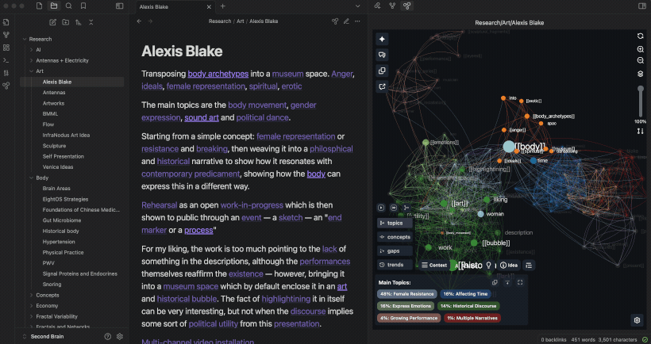
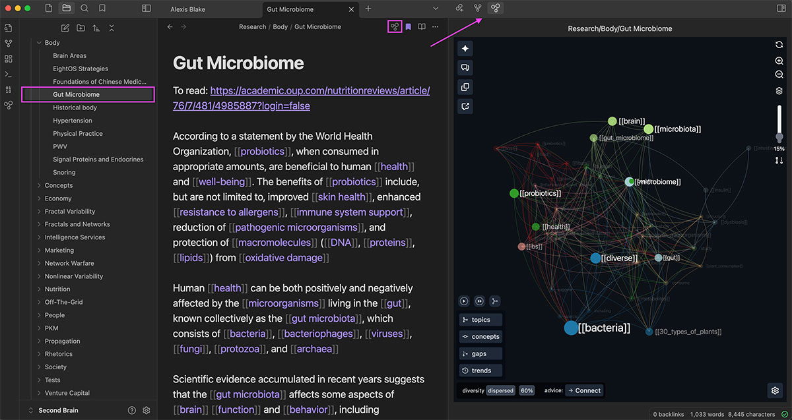
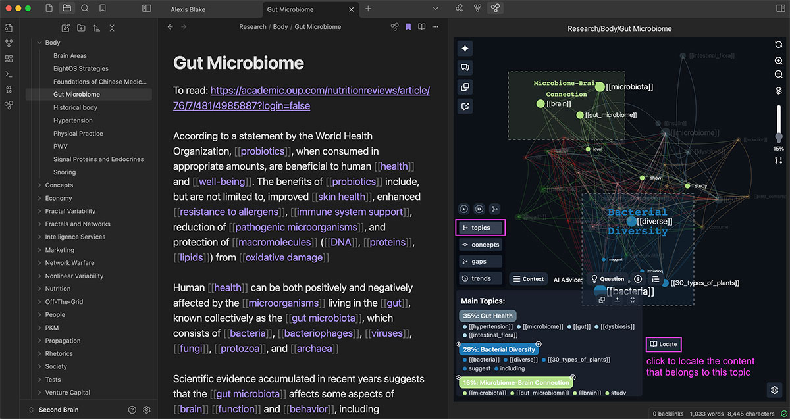
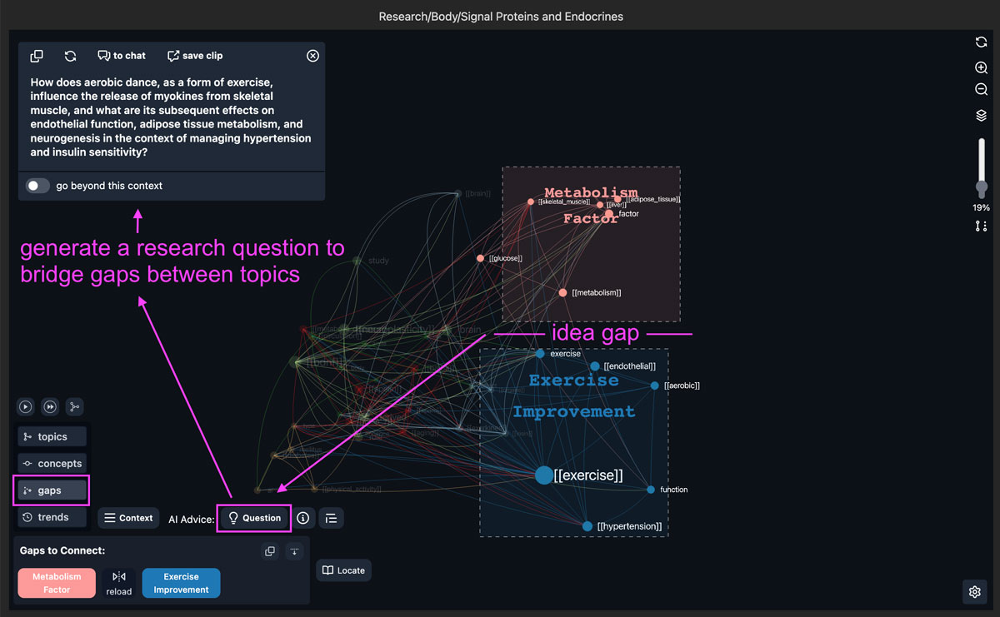
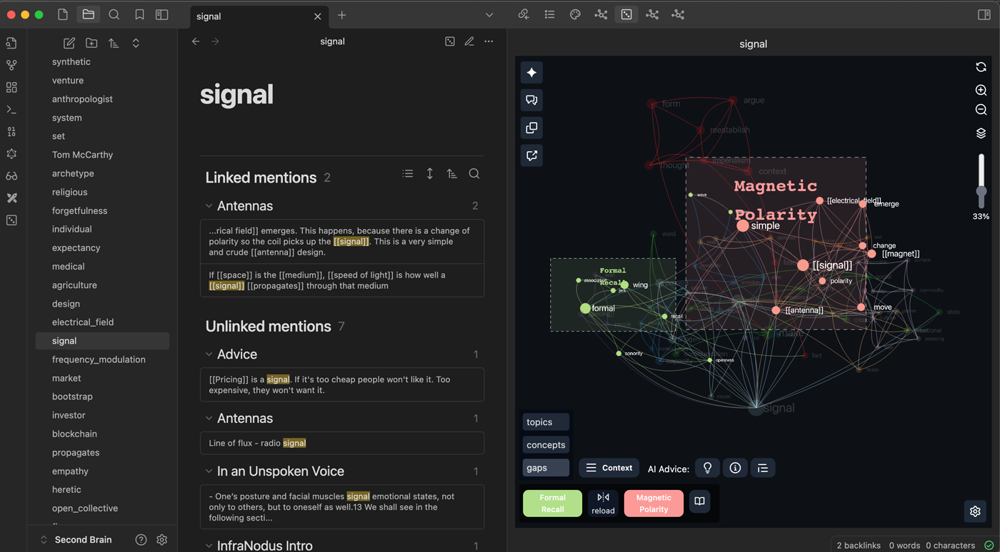
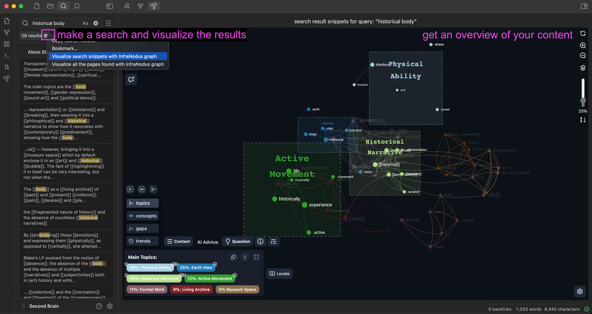
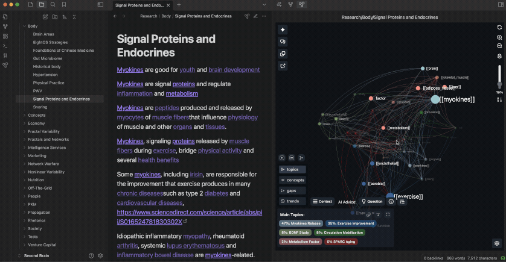
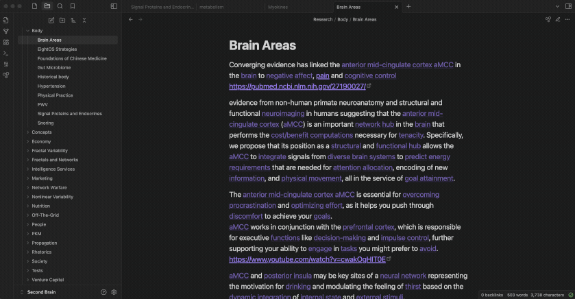

# InfraNodus Advanced Graph View Plugin for Obsidian

Based on [InfraNodus](https://infranodus.com), this plugin visualizes the content of Obsidian vaults as a knowledge graph, retrieves the main topical clusters, most important ideas, and identifies the gaps between them.

The built-in AI can be used to generate new ideas and research questions from your Obsidian content to bridge the gaps identified. Only [InfraNodus](https://infranodus.com) account is needed, OpenAI API GPT-4 use is included with the InfraNodus account, so you don't need your own OpenAI keys.

&nbsp;

&nbsp;

## What Can this Plugin Do?

### 1. Visualize the main ideas on any page:

- take both mentions [[wiki-links]] and concepts into account (can be adjusted)

- use advanced clustering algorithms and a beautiful 3D visualization module

- show connections between ideas inside your text

&nbsp;

### 2. Identify the main topics and most important ideas

Use advanced network science algorithms to:

- detect clusters of concepts that appear together

- highlight the most relevant concepts (shown bigger on the graph)

- locate original content that belongs to the topics identified

&nbsp;

### 3. Identify gaps and generate new ideas using the built-in AI

To help you generate new ideas, you can run the built-in AI on:

- the whole graph structure
- selected topical clusters
- selected concepts
- selected statements
- gaps
- trends
- using the built-in AI chat

&nbsp;

### 4. Include the backlinks and unlinked mentions into analysis

To help you find hidden connections between your ideas, you can:

- include the snippets from backlink mentions into analysis (adjustable)

- include unmentioned snippets into analysis

&nbsp;

### 5. Visualize from any content view

No other graph view plugin offers so many visualization options. You can extract the content to visualize from:

- a single file
- selected files
- vault folders
- search result snippets
- pages found in the search results
- bookmark folders

&nbsp;

### 6. Obtain advanced network science metrics on your graph

\*This plugin has the most comprehensive graph analytics of any Obsidian plugin, including:

- betweenness centrality (bc)
- relative influence
- graph's modularity
- concept's relevanve (bc + degree)
- main relations (bigrams)
- graphDot structure for further analysis

&nbsp;

### 7. Navigate through your vault using the graph

You can navigate between pages using the arrow button

&nbsp;

## Installation Instructions

You can install the plugin from the Obsidian community plugins repository or manually by yourself. Below are the standard installation instructions. For manual installation, see the instructions in our [support article](https://support.noduslabs.com/hc/en-us/articles/14964937162524-InfraNodus-Obsidian-Plugin-Installation-Instructions-User-s-Manual)

- Activate the Community Plugins for your Obsidian Vault (Obsidian > Settings > Community Plugins > Activate Community Plugins).

- Install the InfraNodus 3D Graph View plugin.

- Activate the InfraNodus plugin and go to its settings (Obsidian > Settings > Community Plugins > InfraNodus > Settings).

- Add your InfraNodus API key in the plugin's settings. It which can be found on [https://infranodus.com/subscription](https://infranodus.com/subscription) and you will need an InfraNodus account for that. If you don't have one, you can get a free trial and also use the special code for Obsidian users INFRANODUSOBSIDIAN2024 to get a lifetime 50% discont (limited availability). With the subscription, you can also use the. main version of [InfraNodus](https://infranodus.com), which can import data from multiple sources and has advance analytic capabilities. You will also get a browser extension.

> #### Why do I have to pay after the free trial?
>
> Note, that this product is subscription-based because it's the only way for me to finance this work and the [associated research](https://infranodus.com/about/cognitive-variability) which I've been doing for the last 10 years. I don't have any investors or external grants, so your contibution is the only resource what makes it possible. I believe that the value this tool can bring you is several times higher the subscription fee. If you don't think so, please, feel free to drop me a line and tell me how much you think it's worth and why.

&nbsp;

## User's Manual

The best use case for the plugin is to get an overview of the connections between your ideas and to find the gaps between different topics. Here's how you can do that:

&nbsp;

### 1. Open any page in Obsidian

- Open your Obsidian vault on any page

- Navigate to that page and click the InfraNodus graph button at the top

– You can also right-click on the page's contextual menu and open the plugin from there

### 2. Move the plugin to the sidebar

- For best experience, we recommend moving the plugin to your Obsidian's sidebar like this:

&nbsp;

### 3. Try different activation options

You can activate the plugin in several ways for different views:

- The InfraNodus icon on the top of the page or use the page's contextual menu (right-click)

- File explorer / vault folder: just right-click on it and choose "InfraNodus Graph"

- Selected files: select the files, right click, choose "InfraNodus Graph"

- Main menu icon (on the left) — will visualize the nearest vault folder to the page currently selected

- Search result snippets (use the ... button next to search result count) — *experimental*

- Search result pages (use the ... button, choose the pages to analyze all the pages found)

- Bookmark groups: select the groups, right-click and analyze using the contextual menu. _Your Core Bookmarks plugin has to be activated._

- Bookmarks: select the files, right-click and analyze using the contextual menu. _Your Core Bookmarks plugin has to be activated._ (experimental)

&nbsp;

### 4. Read the graph

- Once activated, InfraNodus will open a graph visualization of the page's content.

- The words and the [[wikilinks]] that you use are the nodes and their co-occurrences inside the text (or links between them if you're analyzing several pages) are the connections between them. (E.g.: if you mention [[philosophy]] and [[deconstruction]] in the same context, they will show up as connected — you can change that in settings).

- Based on network science metrics, the nodes will be ranged by their importance (betweenness centrality) and aligned into groups (topical clusters), which will have the same color. Based on this representation, you can see what are the **most important** ideas and what **topical clusters** exist in your document.

- We use force-atlas layout to align the nodes that are more densely connected closer to each other on the graph

> To learn more about the science behind the tool, please, check the [InfraNodus - How it Works (https://infranodus.com/about/how-it-works) page as well as the the peer-reviewed [InfraNodus Whitepaper](https://dl.acm.org/doi/10.1145/3308558.3314123).

- Use the graph visualization to get an overview of what the text is about and see if anything is missing.

&nbsp;

### 5. Explore the main topics, find the context, generate AI summaries

- Click on the "Topics" to see the main topics present in the document. You can use the built-in GPT-4 AI to generate a summary of the document in "Topics" > "Summary".

- Click on the terms that seem relevant to you and then click on the "Concepts" > "Context" button to see the context where these terms appear in the document (the actual statement). You can also navigate directly to that statement in Obsidian and visualize a new graph of the document where the statement is contained.

&nbsp;

### 6. Identify the gaps and use the AI to generate new ideas

- Most interesting feature: click on the "Gaps" and see the blind holes identified in your content. These are the clusters of ideas that could be better connected. Use the built-in AI to generate interesting research questions that will help you develop the ideas in your notes further.

&nbsp;

### 7. Reveal non-obvious layer of underlying ideas

- Remove the top nodes from the graph (select > hide) to reveal underlying ideas and latent topics that are not visible on the surface.

&nbsp;

### 8. Reiterate

- If you find a concept or topic you like, you can also use InfraNodus to **navigate** to that page. Just click the node in the graph and then click the arrow above to proceed to that page.

### 9. Save and export ideas

- Feel free to export the most interesting excerpts and AI-generated ideas to InfraNodus for later reference and analysis.

&nbsp;

## Settings

Here is a brief expalanation of the InfraNodus settings:

**InfraNodus API Key** - connects your plugin to your InfraNodus account

**AI model** — AI model to use (we like GPT-4 the most, but you can use GPT-4o-mini and such)

**Single page processing** — How to process the content on the single pages. We recommend [[wiki links]] and concepts so you can see all possible connections.

**Multi page processing** — How to process the content when multiple pages are analyzed. We recommend [[wiki links]] only so you can visualize the mentions only.

**Include linked / unlinked mentions** — shall we include the snippets shown in the backlinks / unlinked mentions to the analysis?

**Improve unliked search** — shall we do an aggressive search for any mention (finds more stuff than Obsidian's default one)

**Updating graph** — should we update the graph every time you change it (Automatic) or only when you press a button

**Default graph layer** — which graph layer to show by default? We like "Topics" for novice users, but for advanced users or mobile screens you might want to choose "Graph", so you give more space to the graph

**Export type** - you can export the data you're currently analyzing using the Export button (4th from the top in the left-side menu). You have two options: copying and pasting the content (requires your confirmation, doesn't work for big pages) or saving it automatically via our API (faster, in this case, it'll be saved into the graph selected in the next setting)

**Export to graph name** - how the name of your export graph is generated (you can choose "obsidian_files" to save everything to one graph — that works better if you're only saving AI ideas and content snippets)

**Graph name** — where to save AI insights when you export them

**When using locate** — what to do when you click "Locate statement" or "find in context" — should we open the edit mode (works beter) or leave it as it is.

&nbsp;

## Data Privacy

We do not save any data you send to InfraNodus servers via the Obsidian plugin to keep your privacy intact — not even in the logs. Our servers simply convert the text you choose to visualize into a JSON graph and send it back to the plugin along with important metrics for visualization.

When you use some of the parts of the graph to generate AI content, we only send the underlying graph structure and some of the statements that relate to the parts of the graph you selected (not your whole document) to the OpenAI's API in order to get a response. OpenAI's terms of use state that they do not use data received via the API for training their models.

While the plugin is in the beta stage we collect data about the features of the extension you use, so we can improve this plugin for you. We do not collect any information from your Obsidian vault.

&nbsp;

## Problems? Questions?

If you have a problem using the plugin, you can open an issue in our [github repository](https://github.com/noduslabs/infranodus-obsidian-plugin/issues) or contact us via the [support portal](https://support.noduslabs.com) or [Discord channel](https://discord.gg/v4BWAvTfB9).

Please, describe in detail what you've been trying to do and your system setup, so we can troubleshoot your issue quickly.

Also, note, that Obsidian does not expose all the endpoints via their API, therefore some functionality may be unstable.

Here are some most urgent feature requests for their team, that you can support with your comments: [contextual menus for bookmarks](https://forum.obsidian.md/t/expose-contextual-menus-for-bookmarks-natively/89408) and [expose search results via API](https://forum.obsidian.md/t/expose-search-result-snippets-via-the-api/89407)

&nbsp;

## More Information

You can learn more about InfraNodus that powers this plugin on [www.infranodus.com](https://infranodus.com).

Also, please, check our support portal on [https://support.noduslabs.com](https://support.noduslabs.com) where you can learn more about network science and various use cases and practical applications.

You can contact us directly via the support portal above or via our [Discord channel](https://discord.gg/v4BWAvTfB9).

We also invite you to subscribe to the [Nodus Labs YouTube channel](https://youtube.com/@noduslabs), [Instagram](https://instagram.com/infranodus), and [Twitter](https://twitter.com/infranodus) where you can learn more about the various exciting use cases for the plugin.

&nbsp;

## Legal Information

This plugin was developed by Nodus Labs (Ways Ltd in UK). You can find full information about our company and our contacts on [www.noduslabs.com](https://noduslabs.com).

The plugin uses the software created by InfraNodus. When you are using the plugin, you agree to the [Terms of Use](https://infranodus.com/about/terms-conditions) and [Privacy Policy](https://infranodus.com/about/privacy-policy).

TLDR: We will never sell or trade your personal registration data. By default, our plugin does not save any data from your Obsidian vault to your InfraNodus account. You use the extension at your own risk and we don't guarantee anything in the legal sense (it's a standard clause for all software companies). Please, refer to the Terms and Privacy Policy above for more information.
